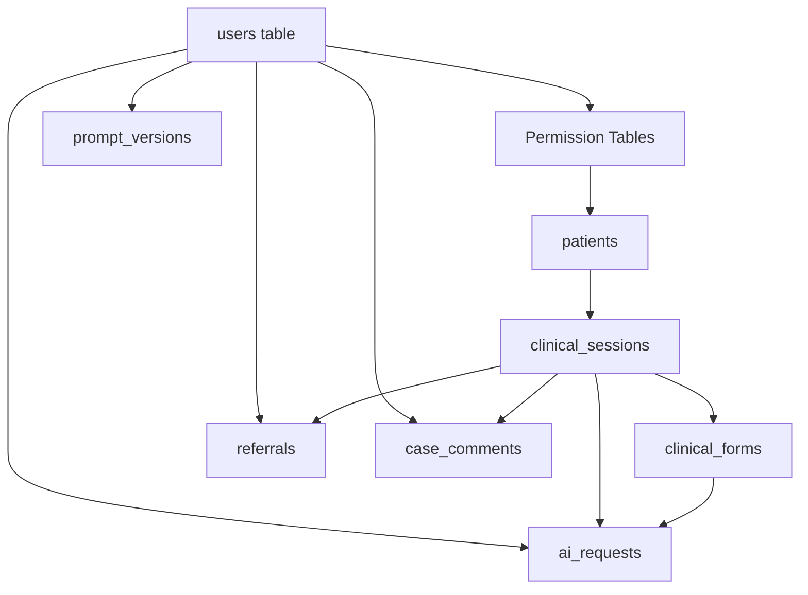

# HealthBridge Phase 0 Database Migrations Documentation

This document provides comprehensive documentation for all Phase 0 database migrations in the HealthBridge project, including table structures, relationships, indexes, and how they support the role-based access control (RBAC) system.

## Table of Contents

1. [Overview](#overview)
2. [Migration Execution Order](#migration-execution-order)
3. [Migration Dependencies](#migration-dependencies)
4. [Migration Details](#migration-details)
   - [Permission Tables Migration](#1-permission-tables-migration)
   - [Patients Table Migration](#2-patients-table-migration)
   - [Clinical Sessions Table Migration](#3-clinical-sessions-table-migration)
   - [Clinical Forms Table Migration](#4-clinical-forms-table-migration)
   - [AI Requests Table Migration](#5-ai-requests-table-migration)
   - [Referrals Table Migration](#6-referrals-table-migration)
   - [Prompt Versions Table Migration](#7-prompt-versions-table-migration)
   - [Case Comments Table Migration](#8-case-comments-table-migration)
5. [Entity Relationship Diagram](#entity-relationship-diagram)
6. [Role-Based Access Control System](#role-based-access-control-system)
7. [Eloquent Model Reference](#eloquent-model-reference)

---

## Overview

Phase 0 migrations establish the foundational database schema for the HealthBridge clinical platform. These migrations create:

- **RBAC Infrastructure**: Spatie Permission-based role and permission tables
- **Clinical Data Models**: Patients, sessions, forms, and referrals
- **AI Governance**: Request logging and prompt version management
- **Collaboration Features**: Case comments and feedback system

All Phase 0 migrations are dated `2026_02_15` and are numbered sequentially from `000001` to `000008`.

---

## Migration Execution Order

Migrations execute in alphabetical order based on their filename timestamp:

| Order | Migration File | Table(s) Created |
|-------|---------------|------------------|
| 1 | `2026_02_15_000001_create_permission_tables.php` | `permissions`, `roles`, `model_has_permissions`, `model_has_roles`, `role_has_permissions` |
| 2 | `2026_02_15_000002_create_patients_table.php` | `patients` |
| 3 | `2026_02_15_000003_create_clinical_sessions_table.php` | `clinical_sessions` |
| 4 | `2026_02_15_000004_create_clinical_forms_table.php` | `clinical_forms` |
| 5 | `2026_02_15_000005_create_ai_requests_table.php` | `ai_requests` |
| 6 | `2026_02_15_000006_create_referrals_table.php` | `referrals` |
| 7 | `2026_02_15_000007_create_prompt_versions_table.php` | `prompt_versions` |
| 8 | `2026_02_15_000008_create_case_comments_table.php` | `case_comments` |

---

## Migration Dependencies



### Dependency Details

| Migration | Dependencies | Reason |
|-----------|-------------|--------|
| Permission Tables | `users` table | References users via polymorphic relationships |
| Patients | None | Standalone entity |
| Clinical Sessions | Patients | References `patient_cpt` (logical, not FK) |
| Clinical Forms | Clinical Sessions, Patients | References `session_couch_id`, `patient_cpt` |
| AI Requests | Users, Clinical Sessions, Clinical Forms | Foreign keys to `users`, references sessions/forms |
| Referrals | Users, Clinical Sessions | Foreign keys to `users`, references `session_couch_id` |
| Prompt Versions | Users | Foreign key to `users` (`created_by`) |
| Case Comments | Users, Clinical Sessions | Foreign key to `users`, references `session_couch_id` |

---

## Migration Details

### 1. Permission Tables Migration

**File**: [`2026_02_15_000001_create_permission_tables.php`](../database/migrations/2026_02_15_000001_create_permission_tables.php)

**Purpose**: Creates the Spatie Permission package tables for role-based access control (RBAC). This migration implements a flexible permission system where users can have roles, and roles can have permissions.

#### Tables Created

##### `permissions` Table

| Column | Type | Constraints | Description |
|--------|------|-------------|-------------|
| `id` | `bigIncrements` | PRIMARY KEY | Auto-incrementing ID |
| `name` | `string` | UNIQUE(name, guard_name) | Permission name (e.g., 'use-ai') |
| `guard_name` | `string` | UNIQUE(name, guard_name) | Auth guard (default: 'web') |
| `created_at` | `timestamp` | - | Creation timestamp |
| `updated_at` | `timestamp` | - | Update timestamp |

##### `roles` Table

| Column | Type | Constraints | Description |
|--------|------|-------------|-------------|
| `id` | `bigIncrements` | PRIMARY KEY | Auto-incrementing ID |
| `name` | `string` | UNIQUE(name, guard_name) | Role name (e.g., 'nurse', 'doctor') |
| `guard_name` | `string` | UNIQUE(name, guard_name) | Auth guard (default: 'web') |
| `created_at` | `timestamp` | - | Creation timestamp |
| `updated_at` | `timestamp` | - | Update timestamp |

##### `model_has_permissions` Table

| Column | Type | Constraints | Description |
|--------|------|-------------|-------------|
| `permission_id` | `unsignedBigInteger` | FK → permissions.id (CASCADE) | Permission reference |
| `model_type` | `string` | PRIMARY KEY (composite) | Polymorphic model class |
| `model_id` | `unsignedBigInteger` | PRIMARY KEY (composite) | Polymorphic model ID |

**Primary Key**: `(permission_id, model_id, model_type)`

##### `model_has_roles` Table

| Column | Type | Constraints | Description |
|--------|------|-------------|-------------|
| `role_id` | `unsignedBigInteger` | FK → roles.id (CASCADE) | Role reference |
| `model_type` | `string` | PRIMARY KEY (composite) | Polymorphic model class |
| `model_id` | `unsignedBigInteger` | PRIMARY KEY (composite) | Polymorphic model ID |

**Primary Key**: `(role_id, model_id, model_type)`

##### `role_has_permissions` Table

| Column | Type | Constraints | Description |
|--------|------|-------------|-------------|
| `permission_id` | `unsignedBigInteger` | FK → permissions.id (CASCADE), PRIMARY KEY (composite) | Permission reference |
| `role_id` | `unsignedBigInteger` | FK → roles.id (CASCADE), PRIMARY KEY (composite) | Role reference |

**Primary Key**: `(permission_id, role_id)`

#### Foreign Keys

| From Table | From Column | To Table | To Column | On Delete |
|------------|-------------|----------|-----------|-----------|
| `model_has_permissions` | `permission_id` | `permissions` | `id` | CASCADE |
| `model_has_roles` | `role_id` | `roles` | `id` | CASCADE |
| `role_has_permissions` | `permission_id` | `permissions` | `id` | CASCADE |
| `role_has_permissions` | `role_id` | `roles` | `id` | CASCADE |

#### Indexes

| Table | Index Name | Columns | Type |
|-------|------------|---------|------|
| `permissions` | - | `(name, guard_name)` | UNIQUE |
| `roles` | - | `(name, guard_name)` | UNIQUE |
| `model_has_permissions` | `model_has_permissions_permission_model_type_primary` | `(permission_id, model_id, model_type)` | PRIMARY |
| `model_has_roles` | `model_has_roles_role_model_type_primary` | `(role_id, model_id, model_type)` | PRIMARY |
| `role_has_permissions` | `role_has_permissions_permission_id_role_id_primary` | `(permission_id, role_id)` | PRIMARY |

#### Configuration

The migration reads table names from [`config/permission.php`](../config/permission.php):

```php
'table_names' => [
    'roles' => 'roles',
    'permissions' => 'permissions',
    'model_has_permissions' => 'model_has_permissions',
    'model_has_roles' => 'model_has_roles',
    'role_has_permissions' => 'role_has_permissions',
],
```

---

### 2. Patients Table Migration

**File**: [`2026_02_15_000002_create_patients_table.php`](../database/migrations/2026_02_15_000002_create_patients_table.php)

**Purpose**: Creates the `patients` table to store patient demographic and clinical data synced from CouchDB. This table serves as the MySQL cache for patient documents stored in CouchDB.

#### Table Structure

| Column | Type | Constraints | Description |
|--------|------|-------------|-------------|
| `id` | `bigint unsigned` | PRIMARY KEY, AUTO_INCREMENT | Unique identifier |
| `couch_id` | `string` | UNIQUE, NULLABLE | CouchDB document ID |
| `cpt` | `string(20)` | UNIQUE | Clinical Patient ID (primary identifier) |
| `short_code` | `string(10)` | NULLABLE | Short display code |
| `external_id` | `string` | NULLABLE | External system reference |
| `date_of_birth` | `date` | NULLABLE | Patient date of birth |
| `age_months` | `integer` | NULLABLE | Age in months (for pediatric patients) |
| `gender` | `enum('male', 'female', 'other')` | NULLABLE | Biological gender |
| `weight_kg` | `decimal(5,2)` | NULLABLE | Weight in kilograms |
| `phone` | `string(30)` | NULLABLE | Contact phone number |
| `visit_count` | `integer` | DEFAULT 1 | Number of visits |
| `is_active` | `boolean` | DEFAULT true | Active patient flag |
| `raw_document` | `json` | NULLABLE | Full CouchDB document (for debugging) |
| `last_visit_at` | `timestamp` | NULLABLE | Last visit timestamp |
| `created_at` | `timestamp` | - | Creation timestamp |
| `updated_at` | `timestamp` | - | Update timestamp |

#### Indexes

| Index Name | Columns | Purpose |
|------------|---------|---------|
| `patients_cpt_unique` | `cpt` | Ensure unique patient IDs |
| `patients_couch_id_unique` | `couch_id` | Ensure unique CouchDB references |
| - | `(cpt, is_active)` | Filter active patients by CPT |
| - | `age_months` | Age-based queries |

#### Eloquent Model

**Model**: [`App\Models\Patient`](../app/Models/Patient.php)

```php
// Key relationships
public function sessions() // HasMany → ClinicalSession

// Key methods
public function calculateAgeMonths(): ?int
public static function syncFromCouch(array $doc): self
```

---

### 3. Clinical Sessions Table Migration

**File**: [`2026_02_15_000003_create_clinical_sessions_table.php`](../database/migrations/2026_02_15_000003_create_clinical_sessions_table.php)

**Purpose**: Creates the `clinical_sessions` table to track patient visits through the clinical workflow. Each session represents a single patient encounter from registration through discharge.

#### Table Structure

| Column | Type | Constraints | Description |
|--------|------|-------------|-------------|
| `id` | `bigint unsigned` | PRIMARY KEY, AUTO_INCREMENT | Unique identifier |
| `couch_id` | `string` | UNIQUE | CouchDB document ID |
| `session_uuid` | `string(50)` | UNIQUE | Human-readable session identifier |
| `patient_cpt` | `string(20)` | NULLABLE | Patient CPT reference (logical FK) |
| `stage` | `enum` | DEFAULT 'registration' | Workflow stage |
| `status` | `enum` | DEFAULT 'open' | Session status |
| `triage_priority` | `enum` | DEFAULT 'unknown' | Triage color code |
| `chief_complaint` | `string` | NULLABLE | Primary reason for visit |
| `notes` | `text` | NULLABLE | Clinical notes |
| `form_instance_ids` | `json` | NULLABLE | Array of associated form IDs |
| `session_created_at` | `timestamp` | NULLABLE | Original creation time (from CouchDB) |
| `session_updated_at` | `timestamp` | NULLABLE | Last update time (from CouchDB) |
| `completed_at` | `timestamp` | NULLABLE | Session completion timestamp |
| `synced_at` | `timestamp` | NULLABLE | Last sync timestamp |
| `raw_document` | `json` | NULLABLE | Full CouchDB document |
| `created_at` | `timestamp` | - | Record creation timestamp |
| `updated_at` | `timestamp` | - | Record update timestamp |

#### Enum Values

| Column | Values |
|--------|--------|
| `stage` | `'registration'`, `'assessment'`, `'treatment'`, `'discharge'` |
| `status` | `'open'`, `'completed'`, `'archived'`, `'referred'`, `'cancelled'` |
| `triage_priority` | `'red'`, `'yellow'`, `'green'`, `'unknown'` |

#### Indexes

| Index Name | Columns | Purpose |
|------------|---------|---------|
| `clinical_sessions_couch_id_unique` | `couch_id` | Unique CouchDB reference |
| `clinical_sessions_session_uuid_unique` | `session_uuid` | Unique session identifier |
| - | `(status, triage_priority)` | Filter by status and priority |
| - | `(patient_cpt, status)` | Patient session history |
| - | `session_created_at` | Time-based queries |

#### Eloquent Model

**Model**: [`App\Models\ClinicalSession`](../app/Models/ClinicalSession.php)

```php
// Key relationships
public function patient()      // BelongsTo → Patient
public function forms()        // HasMany → ClinicalForm
public function referrals()    // HasMany → Referral
public function comments()     // HasMany → CaseComment
public function aiRequests()   // HasMany → AiRequest

// Scopes
public function scopeOpen($query)
public function scopeByPriority($query, string $priority)
public function scopeRed($query)

// Methods
public static function syncFromCouch(array $doc): self
```

---

### 4. Clinical Forms Table Migration

**File**: [`2026_02_15_000004_create_clinical_forms_table.php`](../database/migrations/2026_02_15_000004_create_clinical_forms_table.php)

**Purpose**: Creates the `clinical_forms` table to store dynamic clinical form data. Forms are schema-driven and support workflow states for draft/completed/submitted status tracking.

#### Table Structure

| Column | Type | Constraints | Description |
|--------|------|-------------|-------------|
| `id` | `bigint unsigned` | PRIMARY KEY, AUTO_INCREMENT | Unique identifier |
| `couch_id` | `string` | UNIQUE | CouchDB document ID |
| `form_uuid` | `string(50)` | UNIQUE | Human-readable form identifier |
| `session_couch_id` | `string` | NULLABLE | Parent session reference |
| `patient_cpt` | `string(20)` | NULLABLE | Patient CPT reference |
| `schema_id` | `string(50)` | - | Form schema identifier |
| `schema_version` | `string(20)` | NULLABLE | Schema version |
| `current_state_id` | `string` | NULLABLE | Current workflow state |
| `status` | `enum` | DEFAULT 'draft' | Form status |
| `sync_status` | `enum` | DEFAULT 'pending' | Synchronization status |
| `answers` | `json` | - | Form answers (key-value pairs) |
| `calculated` | `json` | NULLABLE | Calculated values (triage, scores) |
| `audit_log` | `json` | NULLABLE | Change history |
| `form_created_at` | `timestamp` | NULLABLE | Original creation time |
| `form_updated_at` | `timestamp` | NULLABLE | Last update time |
| `completed_at` | `timestamp` | NULLABLE | Completion timestamp |
| `synced_at` | `timestamp` | NULLABLE | Last sync timestamp |
| `raw_document` | `json` | NULLABLE | Full CouchDB document |
| `created_at` | `timestamp` | - | Record creation timestamp |
| `updated_at` | `timestamp` | - | Record update timestamp |

#### Enum Values

| Column | Values |
|--------|--------|
| `status` | `'draft'`, `'completed'`, `'submitted'`, `'synced'`, `'error'` |
| `sync_status` | `'pending'`, `'syncing'`, `'synced'`, `'error'` |

#### Indexes

| Index Name | Columns | Purpose |
|------------|---------|---------|
| `clinical_forms_couch_id_unique` | `couch_id` | Unique CouchDB reference |
| `clinical_forms_form_uuid_unique` | `form_uuid` | Unique form identifier |
| - | `(schema_id, status)` | Filter forms by schema and status |
| - | `patient_cpt` | Patient form history |
| - | `session_couch_id` | Session form lookup |

#### Eloquent Model

**Model**: [`App\Models\ClinicalForm`](../app/Models/ClinicalForm.php)

```php
// Key relationships
public function session()     // BelongsTo → ClinicalSession
public function patient()     // BelongsTo → Patient
public function aiRequests()  // HasMany → AiRequest

// Scopes
public function scopeCompleted($query)
public function scopeSynced($query)

// Accessors
public function getTriagePriorityAttribute(): string

// Methods
public function hasDangerSign(): bool
public static function syncFromCouch(array $doc): self
```

---

### 5. AI Requests Table Migration

**File**: [`2026_02_15_000005_create_ai_requests_table.php`](../database/migrations/2026_02_15_000005_create_ai_requests_table.php)

**Purpose**: Creates the `ai_requests` table for comprehensive AI governance logging. Every AI interaction is logged with full context for audit, safety monitoring, and compliance purposes.

#### Table Structure

| Column | Type | Constraints | Description |
|--------|------|-------------|-------------|
| `id` | `bigint unsigned` | PRIMARY KEY, AUTO_INCREMENT | Unique identifier |
| `request_uuid` | `uuid` | UNIQUE | Request identifier |
| `user_id` | `foreignId` | FK → users.id (NULL ON DELETE) | Requesting user |
| `role` | `string(50)` | NULLABLE | User's role at request time |
| `session_couch_id` | `string` | NULLABLE | Session context |
| `form_couch_id` | `string` | NULLABLE | Form context |
| `patient_cpt` | `string(20)` | NULLABLE | Patient context |
| `task` | `string(50)` | - | AI task type |
| `use_case` | `string(50)` | NULLABLE | Specific use case |
| `prompt_version` | `string(20)` | NULLABLE | Prompt version used |
| `triage_ruleset_version` | `string(20)` | NULLABLE | Triage rules version |
| `input_hash` | `string(64)` | NULLABLE | SHA-256 hash of input |
| `prompt` | `text` | NULLABLE | Full prompt sent to AI |
| `response` | `longText` | NULLABLE | Raw AI response |
| `safe_output` | `longText` | NULLABLE | Sanitized output for display |
| `model` | `string(50)` | NULLABLE | AI model identifier |
| `model_version` | `string(50)` | NULLABLE | Model version |
| `latency_ms` | `integer` | NULLABLE | Response time in milliseconds |
| `was_overridden` | `boolean` | DEFAULT false | Manual override flag |
| `risk_flags` | `json` | NULLABLE | Array of risk indicators |
| `blocked_phrases` | `json` | NULLABLE | Blocked content detected |
| `override_reason` | `text` | NULLABLE | Reason for override |
| `requested_at` | `timestamp` | NULLABLE | Request timestamp |
| `created_at` | `timestamp` | - | Record creation timestamp |
| `updated_at` | `timestamp` | - | Record update timestamp |

#### Foreign Keys

| From Column | To Table | To Column | On Delete |
|-------------|----------|-----------|-----------|
| `user_id` | `users` | `id` | SET NULL |

#### Indexes

| Index Name | Columns | Purpose |
|------------|---------|---------|
| `ai_requests_request_uuid_unique` | `request_uuid` | Unique request identifier |
| - | `(user_id, task)` | User task history |
| - | `session_couch_id` | Session AI requests |
| - | `requested_at` | Time-based queries |

#### Eloquent Model

**Model**: [`App\Models\AiRequest`](../app/Models/AiRequest.php)

```php
// Key relationships
public function user()    // BelongsTo → User
public function session() // BelongsTo → ClinicalSession
public function form()    // BelongsTo → ClinicalForm

// Scopes
public function scopeByTask($query, string $task)
public function scopeWithRiskFlags($query)
public function scopeOverridden($query)

// Auto-generated UUID on create
protected static function booted(): void
```

---

### 6. Referrals Table Migration

**File**: [`2026_02_15_000006_create_referrals_table.php`](../database/migrations/2026_02_15_000006_create_referrals_table.php)

**Purpose**: Creates the `referrals` table to manage case referrals between clinical staff. Supports the escalation workflow from nurses to specialists.

#### Table Structure

| Column | Type | Constraints | Description |
|--------|------|-------------|-------------|
| `id` | `bigint unsigned` | PRIMARY KEY, AUTO_INCREMENT | Unique identifier |
| `referral_uuid` | `string(50)` | UNIQUE | Human-readable referral ID |
| `session_couch_id` | `string` | - | Session reference |
| `referring_user_id` | `foreignId` | FK → users.id (NULL ON DELETE) | Referring clinician |
| `assigned_to_user_id` | `foreignId` | FK → users.id (NULL ON DELETE) | Assigned clinician |
| `assigned_to_role` | `string(50)` | NULLABLE | Target role for assignment |
| `status` | `enum` | DEFAULT 'pending' | Referral status |
| `priority` | `enum` | - | Priority level |
| `specialty` | `string(50)` | NULLABLE | Target specialty |
| `reason` | `text` | NULLABLE | Referral reason |
| `clinical_notes` | `text` | NULLABLE | Clinical context |
| `rejection_reason` | `text` | NULLABLE | Reason if rejected |
| `assigned_at` | `timestamp` | NULLABLE | Assignment timestamp |
| `accepted_at` | `timestamp` | NULLABLE | Acceptance timestamp |
| `completed_at` | `timestamp` | NULLABLE | Completion timestamp |
| `created_at` | `timestamp` | - | Record creation timestamp |
| `updated_at` | `timestamp` | - | Record update timestamp |

#### Enum Values

| Column | Values |
|--------|--------|
| `status` | `'pending'`, `'accepted'`, `'rejected'`, `'completed'`, `'cancelled'` |
| `priority` | `'red'`, `'yellow'`, `'green'` |

#### Foreign Keys

| From Column | To Table | To Column | On Delete |
|-------------|----------|-----------|-----------|
| `referring_user_id` | `users` | `id` | SET NULL |
| `assigned_to_user_id` | `users` | `id` | SET NULL |

#### Indexes

| Index Name | Columns | Purpose |
|------------|---------|---------|
| `referrals_referral_uuid_unique` | `referral_uuid` | Unique referral identifier |
| - | `(status, priority)` | Filter by status and priority |
| - | `(assigned_to_user_id, status)` | User's assigned referrals |
| - | `session_couch_id` | Session referral lookup |

#### Eloquent Model

**Model**: [`App\Models\Referral`](../app/Models/Referral.php)

```php
// Key relationships
public function session()       // BelongsTo → ClinicalSession
public function referringUser() // BelongsTo → User
public function assignedTo()    // BelongsTo → User

// Scopes
public function scopePending($query)
public function scopeAccepted($query)
public function scopeRed($query)

// Methods
public function accept(int $userId): void
public function reject(string $reason): void
public function complete(): void
```

---

### 7. Prompt Versions Table Migration

**File**: [`2026_02_15_000007_create_prompt_versions_table.php`](../database/migrations/2026_02_15_000007_create_prompt_versions_table.php)

**Purpose**: Creates the `prompt_versions` table for AI prompt version control. Enables tracking of prompt changes, A/B testing, and rollback capabilities.

#### Table Structure

| Column | Type | Constraints | Description |
|--------|------|-------------|-------------|
| `id` | `bigint unsigned` | PRIMARY KEY, AUTO_INCREMENT | Unique identifier |
| `task` | `string(50)` | UNIQUE(task, version) | AI task identifier |
| `version` | `string(20)` | UNIQUE(task, version) | Version string |
| `content` | `text` | - | Prompt template content |
| `description` | `text` | NULLABLE | Change description |
| `is_active` | `boolean` | DEFAULT false | Active version flag |
| `created_by` | `foreignId` | FK → users.id (NULL ON DELETE) | Creator reference |
| `created_at` | `timestamp` | - | Record creation timestamp |
| `updated_at` | `timestamp` | - | Record update timestamp |

#### Foreign Keys

| From Column | To Table | To Column | On Delete |
|-------------|----------|-----------|-----------|
| `created_by` | `users` | `id` | SET NULL |

#### Indexes

| Index Name | Columns | Purpose |
|------------|---------|---------|
| - | `(task, version)` | UNIQUE - Ensure version uniqueness per task |
| - | `(task, is_active)` | Find active prompt for task |

#### Eloquent Model

**Model**: [`App\Models\PromptVersion`](../app/Models/PromptVersion.php)

```php
// Key relationships
public function creator() // BelongsTo → User

// Scopes
public function scopeActive($query)
public function scopeByTask($query, string $task)

// Methods
public static function getActive(string $task): ?self
public function activate(): void  // Deactivates others for same task
```

---

### 8. Case Comments Table Migration

**File**: [`2026_02_15_000008_create_case_comments_table.php`](../database/migrations/2026_02_15_000008_create_case_comments_table.php)

**Purpose**: Creates the `case_comments` table for clinical collaboration and feedback. Supports clinical notes, administrative comments, AI feedback, and rule change suggestions.

#### Table Structure

| Column | Type | Constraints | Description |
|--------|------|-------------|-------------|
| `id` | `bigint unsigned` | PRIMARY KEY, AUTO_INCREMENT | Unique identifier |
| `session_couch_id` | `string` | - | Session reference |
| `user_id` | `foreignId` | FK → users.id (NULL ON DELETE) | Comment author |
| `comment` | `text` | - | Comment content |
| `comment_type` | `enum` | DEFAULT 'clinical' | Type of comment |
| `suggested_rule_change` | `string` | NULLABLE | Rule change suggestion |
| `requires_followup` | `boolean` | DEFAULT false | Follow-up flag |
| `created_at` | `timestamp` | - | Record creation timestamp |
| `updated_at` | `timestamp` | - | Record update timestamp |

#### Enum Values

| Column | Values |
|--------|--------|
| `comment_type` | `'clinical'`, `'administrative'`, `'feedback'`, `'flag'` |

#### Foreign Keys

| From Column | To Table | To Column | On Delete |
|-------------|----------|-----------|-----------|
| `user_id` | `users` | `id` | SET NULL |

#### Indexes

| Index Name | Columns | Purpose |
|------------|---------|---------|
| - | `(session_couch_id, created_at)` | Chronological session comments |

#### Eloquent Model

**Model**: [`App\Models\CaseComment`](../app/Models/CaseComment.php)

```php
// Key relationships
public function session() // BelongsTo → ClinicalSession
public function user()    // BelongsTo → User

// Scopes
public function scopeClinical($query)
public function scopeFeedback($query)
public function scopeFlagged($query)
public function scopeRequiresFollowup($query)
```

---

## Entity Relationship Diagram

```
┌─────────────────────────────────────────────────────────────────────────────────┐
│                              HEALTHBRIDGE DATABASE SCHEMA                        │
└─────────────────────────────────────────────────────────────────────────────────┘

┌──────────────────┐       ┌──────────────────┐       ┌──────────────────┐
│     users        │       │   permissions    │       │      roles       │
├──────────────────┤       ├──────────────────┤       ├──────────────────┤
│ id               │───┐   │ id               │───┐   │ id               │
│ name             │   │   │ name             │   │   │ name             │
│ email            │   │   │ guard_name       │   │   │ guard_name       │
│ password         │   │   └──────────────────┘   │   └──────────────────┘
│ two_factor_*     │   │            │             │            │
└──────────────────┘   │            │             │            │
         │             │            ▼             │            ▼
         │             │   ┌──────────────────┐   │   ┌──────────────────┐
         │             │   │model_has_        │   │   │role_has_         │
         │             │   │permissions       │   │   │permissions       │
         │             │   ├──────────────────┤   │   ├──────────────────┤
         │             └──►│ permission_id    │◄──┴──►│ permission_id    │
         │                 │ model_type      │       │ role_id          │
         │                 │ model_id        │       └──────────────────┘
         │                 └──────────────────┘               │
         │                                                    │
         │                 ┌──────────────────┐               │
         │                 │model_has_roles   │               │
         │                 ├──────────────────┤               │
         └────────────────►│ role_id          │◄──────────────┘
                           │ model_type      │
                           │ model_id        │
                           └──────────────────┘

┌──────────────────┐       ┌──────────────────┐       ┌──────────────────┐
│    patients      │       │clinical_sessions │       │ clinical_forms   │
├──────────────────┤       ├──────────────────┤       ├──────────────────┤
│ id               │       │ id               │       │ id               │
│ couch_id    ◄────┼───┐   │ couch_id    ◄────┼───┐   │ couch_id    ◄────┤
│ cpt         ◄────┼───┼──►│ session_uuid     │   │   │ form_uuid        │
│ short_code       │   │   │ patient_cpt  ────┼───┘   │ session_couch_id │
│ date_of_birth    │   │   │ stage            │       │ patient_cpt      │
│ age_months       │   │   │ status           │       │ schema_id        │
│ gender           │   │   │ triage_priority  │       │ status           │
│ weight_kg        │   │   │ chief_complaint  │       │ sync_status      │
│ visit_count      │   │   │ form_instance_ids│       │ answers (JSON)   │
│ is_active        │   │   └──────────────────┘       │ calculated (JSON)│
└──────────────────┘   │            │                 └──────────────────┘
                       │            │                          │
                       │            ▼                          │
                       │   ┌──────────────────┐                │
                       │   │   referrals      │                │
                       │   ├──────────────────┤                │
                       │   │ id               │                │
                       │   │ referral_uuid    │                │
                       │   │ session_couch_id │                │
                       │   │ referring_user_id│──────┐         │
                       │   │ assigned_to_     │      │         │
                       │   │   user_id        │──────┼──┐      │
                       │   │ status           │      │  │      │
                       │   │ priority         │      │  │      │
                       │   └──────────────────┘      │  │      │
                       │            │                │  │      │
                       │            │                │  │      │
                       │   ┌──────────────────┐      │  │      │
                       │   │ case_comments    │      │  │      │
                       │   ├──────────────────┤      │  │      │
                       │   │ id               │      │  │      │
                       │   │ session_couch_id │      │  │      │
                       │   │ user_id          │──────┼──┼──┐   │
                       │   │ comment          │      │  │  │   │
                       │   │ comment_type     │      │  │  │   │
                       │   └──────────────────┘      │  │  │   │
                       │                            │  │  │   │
                       │   ┌──────────────────┐      │  │  │   │
                       │   │   ai_requests    │      │  │  │   │
                       │   ├──────────────────┤      │  │  │   │
                       │   │ id               │      │  │  │   │
                       │   │ request_uuid     │      │  │  │   │
                       │   │ user_id          │──────┼──┼──┼───┤
                       │   │ session_couch_id │      │  │  │   │
                       │   │ form_couch_id    │      │  │  │   │
                       │   │ task             │      │  │  │   │
                       │   │ prompt           │      │  │  │   │
                       │   │ response         │      │  │  │   │
                       │   │ risk_flags (JSON)│      │  │  │   │
                       │   └──────────────────┘      │  │  │   │
                       │                            │  │  │   │
                       │   ┌──────────────────┐      │  │  │   │
                       │   │ prompt_versions  │      │  │  │   │
                       │   ├──────────────────┤      │  │  │   │
                       │   │ id               │      │  │  │   │
                       │   │ task             │      │  │  │   │
                       │   │ version          │      │  │  │   │
                       │   │ content          │      │  │  │   │
                       │   │ is_active        │      │  │  │   │
                       │   │ created_by       │──────┼──┼──┘   │
                       │   └──────────────────┘      │  │      │
                       │                            │  │      │
                       └────────────────────────────┴──┴──────┘
                                              │
                                              ▼
                                    ┌──────────────────┐
                                    │     users        │
                                    │  (see above)     │
                                    └──────────────────┘
```

---

## Role-Based Access Control System

### Overview

HealthBridge implements role-based access control using the **Spatie Permission** package. The RBAC system controls:

1. **AI Feature Access**: Which AI capabilities each role can use
2. **Clinical Data Access**: Visibility of patient cases and sessions
3. **Workflow Permissions**: Ability to create referrals, accept cases, add comments
4. **Administrative Functions**: User management, prompt management, dashboards

### Roles Defined

| Role | Description | AI Permissions | Clinical Permissions |
|------|-------------|----------------|---------------------|
| `nurse` | Frontline clinical staff | Triage explanation, Caregiver summary | View own cases, Create referrals, Add comments |
| `senior-nurse` | Experienced nurse with oversight | Triage explanation, Caregiver summary | View all cases, Create/Accept referrals, Add comments |
| `doctor` | General physician | Triage explanation, Specialist review | View all cases, Create/Accept referrals, Add comments |
| `radiologist` | Imaging specialist | Imaging interpretation | View all cases, Accept referrals, Add comments |
| `dermatologist` | Skin condition specialist | Basic AI | View all cases, Accept referrals, Add comments |
| `manager` | Clinical manager | None | View dashboards, View all cases |
| `admin` | System administrator | All AI features | Full administrative access |

### Permissions Matrix

```
┌─────────────────────────────┬───────┬─────────────┬────────┬────────────┬───────────────┬─────────┬───────┐
│ Permission                  │ nurse │ senior-nurse│ doctor │ radiologist│ dermatologist │ manager │ admin │
├─────────────────────────────┼───────┼─────────────┼────────┼────────────┼───────────────┼─────────┼───────┤
│ use-ai                      │   ✓   │      ✓      │    ✓   │      ✓     │       ✓       │         │   ✓   │
│ ai-explain-triage           │   ✓   │      ✓      │    ✓   │            │               │         │       │
│ ai-caregiver-summary        │   ✓   │      ✓      │        │            │               │         │       │
│ ai-specialist-review        │       │             │    ✓   │            │               │         │       │
│ ai-imaging-interpretation   │       │             │        │      ✓     │               │         │       │
│ view-own-cases              │   ✓   │      ✓      │        │            │               │         │       │
│ view-cases                  │       │      ✓      │    ✓   │      ✓     │       ✓       │    ✓    │   ✓   │
│ view-all-cases              │       │             │    ✓   │      ✓     │       ✓       │    ✓    │   ✓   │
│ create-referrals            │   ✓   │      ✓      │    ✓   │            │               │         │       │
│ accept-referrals            │       │      ✓      │    ✓   │      ✓     │       ✓       │         │       │
│ add-case-comments           │   ✓   │      ✓      │    ✓   │      ✓     │       ✓       │         │       │
│ view-dashboards             │       │             │        │            │               │    ✓    │   ✓   │
│ view-ai-console             │       │             │        │            │               │         │   ✓   │
│ manage-prompts              │       │             │        │            │               │         │   ✓   │
│ manage-users                │       │             │        │            │               │         │   ✓   │
│ manage-roles                │       │             │        │            │               │         │   ✓   │
└─────────────────────────────┴───────┴─────────────┴────────┴────────────┴───────────────┴─────────┴───────┘
```

### Implementation in User Model

The [`User`](../app/Models/User.php) model uses the `HasRoles` trait from Spatie Permission:

```php
class User extends Authenticatable
{
    use HasFactory, HasApiTokens, Notifiable, TwoFactorAuthenticatable, HasRoles;
    
    /**
     * Check if user can use AI for a specific task.
     */
    public function canUseAi(string $task): bool
    {
        $policy = config('ai_policy.roles', []);
        $userRoles = $this->roles->pluck('name')->toArray();

        foreach ($userRoles as $role) {
            if (isset($policy[$role]) && in_array($task, $policy[$role])) {
                return true;
            }
        }

        return false;
    }
}
```

### Seeding Roles and Permissions

The [`RoleSeeder`](../database/seeders/RoleSeeder.php) class handles the initial setup:

```bash
php artisan db:seed --class=RoleSeeder
```

---

## Eloquent Model Reference

### Model Summary Table

| Model | Table | Primary Key | Notable Features |
|-------|-------|-------------|------------------|
| [`User`](../app/Models/User.php) | `users` | `id` | HasRoles trait, AI permission checks |
| [`Patient`](../app/Models/Patient.php) | `patients` | `id` | CouchDB sync, age calculation |
| [`ClinicalSession`](../app/Models/ClinicalSession.php) | `clinical_sessions` | `id` | Workflow states, triage scopes |
| [`ClinicalForm`](../app/Models/ClinicalForm.php) | `clinical_forms` | `id` | JSON answers, calculated values |
| [`AiRequest`](../app/Models/AiRequest.php) | `ai_requests` | `id` | Auto-UUID, risk flag scopes |
| [`Referral`](../app/Models/Referral.php) | `referrals` | `id` | Status workflow methods |
| [`PromptVersion`](../app/Models/PromptVersion.php) | `prompt_versions` | `id` | Version activation logic |
| [`CaseComment`](../app/Models/CaseComment.php) | `case_comments` | `id` | Comment type scopes |

### Relationship Summary

```
User
├── HasMany: AiRequest
├── HasMany: Referral (as referring_user)
├── HasMany: Referral (as assigned_to_user)
├── HasMany: CaseComment
├── HasMany: PromptVersion (as creator)
└── BelongsToMany: Role (via Spatie Permission)

Patient
└── HasMany: ClinicalSession

ClinicalSession
├── BelongsTo: Patient
├── HasMany: ClinicalForm
├── HasMany: Referral
├── HasMany: CaseComment
└── HasMany: AiRequest

ClinicalForm
├── BelongsTo: ClinicalSession
├── BelongsTo: Patient
└── HasMany: AiRequest

AiRequest
├── BelongsTo: User
├── BelongsTo: ClinicalSession
└── BelongsTo: ClinicalForm

Referral
├── BelongsTo: ClinicalSession
├── BelongsTo: User (as referring_user)
└── BelongsTo: User (as assigned_to_user)

PromptVersion
└── BelongsTo: User (as creator)

CaseComment
├── BelongsTo: ClinicalSession
└── BelongsTo: User
```

---

## Running Migrations

### Fresh Installation

```bash
# Run all migrations
php artisan migrate

# Run with seeding
php artisan migrate --seed
```

### Reset and Re-run

```bash
# Rollback all migrations
php artisan migrate:reset

# Fresh migration with seeding
php artisan migrate:fresh --seed
```

### Run Only Phase 0 Migrations

```bash
# Run specific migration file
php artisan migrate --path=database/migrations/2026_02_15_000001_create_permission_tables.php
php artisan migrate --path=database/migrations/2026_02_15_000002_create_patients_table.php
# ... etc
```

---

## Appendix: Configuration Files

### Permission Configuration

**File**: [`config/permission.php`](../config/permission.php)

Key settings:
- `teams`: Disabled (set to `false`)
- `table_names`: Customizable table names
- `column_names`: Morph key configuration
- `cache`: 24-hour cache expiration

### AI Policy Configuration

The AI policy configuration (referenced in `User::canUseAi()`) defines which roles can perform which AI tasks. This is typically stored in `config/ai_policy.php`.

---

*Documentation generated: February 2026*
*HealthBridge Clinical Platform - Phase 0 Database Schema*
